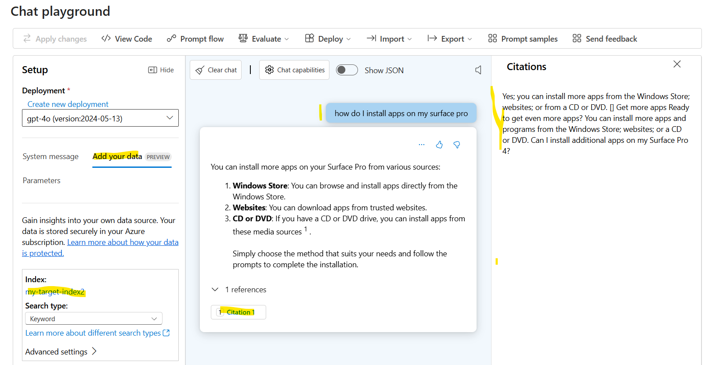
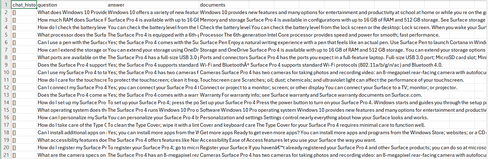
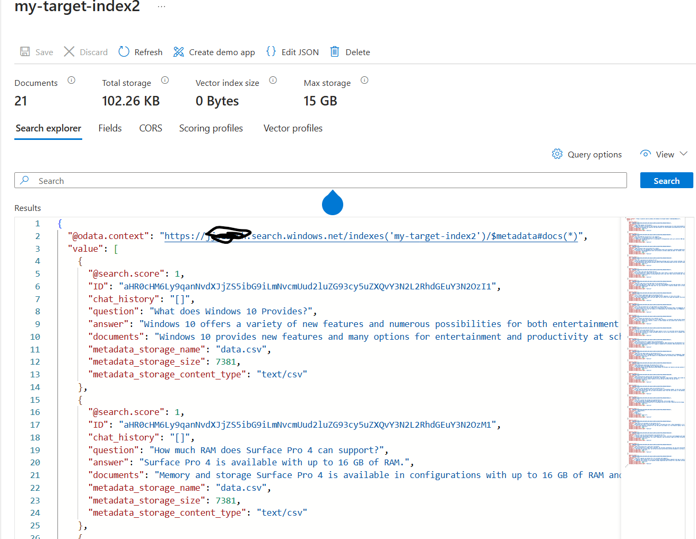

# Indexing CSVs with AI Search to test in AI Studio

Azure AI Studio has a simple chat interface that allow you to test how an application may work when using *your data*



The user interface also lets you choose a blob storage folder and will index the contents in that for you. This is really useful as a code-free aproach for testing simple RAG scenarios.

However, this does not work that well with CSV files as the whole file will by default be treated as one large *blob* to be indexed. Ideally, each of the rows in the CSV show get its own in the index and each of the columns should be represented too. An indexer for AI Search can be created that works with CSVs and this is described [here](https://learn.microsoft.com/en-us/azure/search/search-howto-index-csv-blobs)

This repo shows how you can create a search index manually, outside of Azure AI Studio and then use this inside AI Studio later.

## Prerequisites
To run this in your Azure subscription, you will need:
1. Access to the Azure portal
2. An Azure OpenAI instance with a model deployed. It is suggested a modern one like *gpt-4o*
3. An Azure AI Search instance (this needs to be at least the basic tier)
4. An Azure storage account
5. Some means of executing the REST requests. Visual Studio code is good and has a REST client extension.

   
## Creating a new index
To create and populate a new index on AI Search, three components are needed:
1. a data source
2. an empty index (with the correct definition)
3. an indexer that pulls the files from the data source into the index 

For this to work, some command-line work is needed (in this case some REST calls)

### First the storage account
If you already have a storage account, create a new blob storage *container* and then upload a CSV into the container. This can be all done from the portal. One is supplied in this repo "data.csv*



As you can see from the sample, this CSV has 4 columns:
1. chat_history
2. question
3. answer
4. documents

These columns will be referenced in the index and indexer below.


### Create a data source
The REST request below can be executed in Postman or the REST client in VSCode. There is a file called *requests.http* which may be used.

```
### create a data source
POST https://{{searchservce}}.search.windows.net/datasources?api-version=2024-07-01
Content-Type: application/json
api-key: {{searchkey}}

{
    "name" : "my-blob-datasource",
    "type" : "azureblob",
    "credentials" : { "connectionString" : "{{storageconnectionstring}}" },
    "container" : { "name" : "csv", "query" : "" }
}
```

### Create an index
```
### create an index
POST https://{{searchservce}}.search.windows.net/indexes?api-version=2024-07-01
Content-Type: application/json
api-key: {{searchkey}}

{
    "name" : "my-target-index",
    "fields": [
        { "name": "ID", "type": "Edm.String", "key": true, "searchable": false },
        { "name": "chat_history", "type": "Edm.String", "searchable": true, "filterable": false },
        { "name": "question", "type": "Edm.String", "searchable": true, "filterable": false },
        { "name": "answer", "type": "Edm.String", "searchable": true, "filterable": false },
        { "name": "documents", "type": "Edm.String", "searchable": true, "filterable": false },
        { "name": "metadata_storage_name", "type": "Edm.String", "searchable": false, "filterable": true, "sortable": true  },
        { "name": "metadata_storage_size", "type": "Edm.Int64", "searchable": false, "filterable": true, "sortable": true  },
        { "name": "metadata_storage_content_type", "type": "Edm.String", "searchable": false, "filterable": true, "sortable": true }       
    ]
}
```
This creates an empty index with the right columns.

### Create the indexer
```
### create an indexer
POST https://{{searchservce}}.search.windows.net/indexers?api-version=2024-07-01
Content-Type: application/json
api-key: {{searchkey}}

{
  "name" : "my-csv-indexer2",
  "dataSourceName" : "my-blob-datasource",
  "targetIndexName" : "my-target-index",
  "parameters" : { "configuration" : { "parsingMode" : "delimitedText", "delimitedTextHeaders" : "chat_history,question,answer,documents" } }
}
```

The indexer should then run and populate the named index with one row per row in the CSV.

Once the indexer has run, you can check what's in the index, by clicking on it and then hitting "Search". 

See below:



